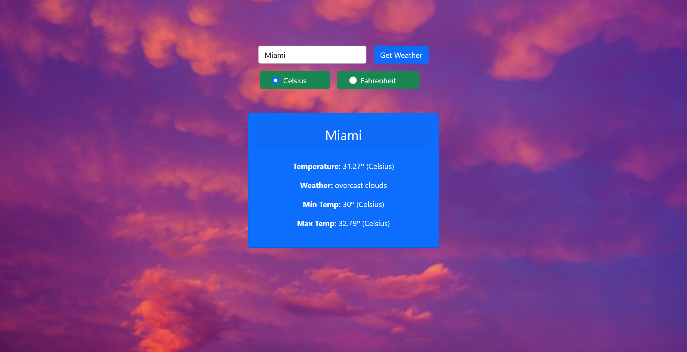

# Javascript Restaurant Page

> Weather App webpage built with Webpack and the Open Weather API, it takes a location and returns the location's temperature in Celsius or Fahrenheit, this is practice for Microverse for API's and Async/Await syntax.

# Application Screenshot



## Built With

- HTML
- Bootstrap 5
- ES6
- Webpack
- Open Weather API

## Live Demo

You can visit [here](https://gabrieljsuarez.github.io/weather-app/) our app.

## Getting Started

To get a local copy up and running follow these simple example steps:

- Clone this repository with:
```
   https://github.com/GabrielJSuarez/weather-app.git
```
- Install Dependencies on package.json:
```
   $ npm install
```
- Build project from script declared in package.json:
```
   $ npm run build
```
- Launch live server visualizer:
```
   $ npm start
```

## Prerequisites

- Web Browser
- Internet connection
- Node.js
- npm

## Instructions

- Select the City to get the Temperature
- Select the unit (Celsius, Fahrenheit)
- Hit `Get Weather` and the info will de displayed
- If you want the weather in another unit just select it and hit `Get Weather` once more.


## Authors

👤 **Gabriel Suarez**
- Github: [@ginnandjuice](https://github.com/ginnandjuice)
- Twitter: [@fatbaxxter](https://twitter.com/fatbaxxter)
- Linkedin: [Gabriel Suárez](https://www.linkedin.com/in/gabriel-ginn-suarez/)


## 🤝 Contributing

Contributions, issues, and feature requests are welcome!

## Show your support

Give a ⭐️ if you like this project!

## 📝 License

This project is [MIT](https://github.com/GabrielJSuarez/JS-library/blob/development/LICENSE.txt) licensed.
